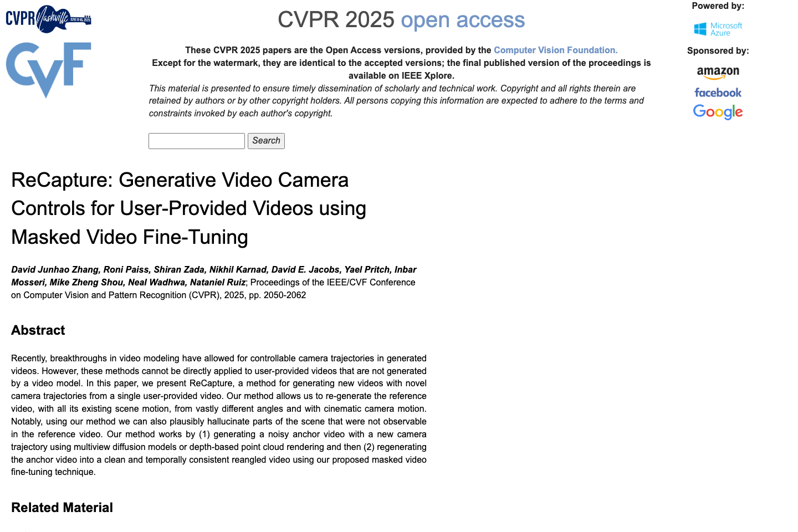

# ReCapture-Unofficial

<div align="center">

**Unofficial PyTorch Reproduction of**  
# ReCapture: Generative Video Camera Controls for User-Provided Videos using Masked Video Fine-Tuning

[CVPR 2025]  
   

[Paper](https://openaccess.thecvf.com/content/CVPR2025/html/Zhang_ReCapture_Generative_Video_Camera_Controls_for_User-Provided_Videos_using_Masked_CVPR_2025_paper.html) · [PDF](https://openaccess.thecvf.com/content/CVPR2025/papers/Zhang_ReCapture_Generative_Video_Camera_Controls_for_User-Provided_Videos_using_Masked_CVPR_2025_paper.pdf) · [Issues](https://github.com/StaryMoon/ReCapture-Unofficial/issues) · [Release](https://github.com/StaryMoon/ReCapture-Unofficial/releases)

</div>

> This is an **unofficial** implementation maintained by [@StaryMoon](https://github.com/StaryMoon). If this repository helps your reading, reproduction, or course project, please consider giving it a star and following my GitHub profile.

## Paper / Project Preview

<p align="center">
  
</p>

<sub>Image source: public paper/project page screenshot, [Paper](https://openaccess.thecvf.com/content/CVPR2025/html/Zhang_ReCapture_Generative_Video_Camera_Controls_for_User-Provided_Videos_using_Masked_CVPR_2025_paper.html). Captured/organized on 2026-07-02. This repository is unofficial and is not affiliated with the paper authors.</sub>

## At a Glance

| Item | Details |
|---|---|
| Paper | ReCapture: Generative Video Camera Controls for User-Provided Videos using Masked Video Fine-Tuning |
| Venue / Source | CVPR 2025 |
| Focus | This repository organizes a PyTorch implementation for ReCapture: Generative Video Camera Controls for User-Provided Videos using Masked Video Fine-Tuning, focusing on user-prov... |
| Repository type | Unofficial PyTorch reproduction starter |
| Local entry point | `python scripts/smoke_test.py` |


## News

- **2026-06-10**: Repository upgraded with an official-style README, paper citation metadata, cleaner package interfaces, default configuration, and release-ready project structure.

## Overview

This repository organizes a PyTorch implementation for **ReCapture: Generative Video Camera Controls for User-Provided Videos using Masked Video Fine-Tuning**, focusing on user-provided video camera control through masked video fine-tuning. The codebase is structured like a standard research repository so that model components, configuration files, scripts, and evaluation utilities can be extended independently.

Main goals:

- provide a clean PyTorch module layout for the paper;
- keep training, inference, evaluation, and configuration entry points explicit;
- track paper-reported metrics separately from local experiment logs;
- make it easy for contributors to inspect, compare, and extend the implementation.

## Repository Structure

```text
ReCapture-Unofficial/
├── configs/
│   └── default.yaml
├── scripts/
│   └── smoke_test.py
├── src/recapture_unofficial/
│   ├── __init__.py
│   └── model.py
├── CITATION.cff
├── README.md
├── requirements.txt
└── pyproject.toml
```

## Installation

```bash
git clone https://github.com/StaryMoon/ReCapture-Unofficial.git
cd ReCapture-Unofficial
python -m venv .venv
source .venv/bin/activate
pip install -r requirements.txt
```

For CUDA-enabled experiments, install the PyTorch build matching your CUDA version from the official PyTorch website before installing the rest of the dependencies.

## Quick Check

Run the minimal forward-pass check:

```bash
python scripts/smoke_test.py
```

Expected output:

```text
output: (...)
loss: ...
```

This confirms that the package import path, model interface, and tensor flow are working.

## Data Preparation

Create local data folders:

```bash
mkdir -p data/train data/val data/test checkpoints outputs
```

Recommended layout:

```text
data/
├── train/
├── val/
└── test/
```

Keep private datasets, downloaded checkpoints, and generated outputs out of git. Dataset-specific converters can be added under `scripts/` while preserving the public repository structure.

## Training

Minimal module usage:

```python
import torch
from recapture_unofficial import ModelConfig, UnofficialModel, reconstruction_loss

config = ModelConfig(task="video", hidden_dim=128, num_layers=2, num_heads=4)
model = UnofficialModel(config)
optimizer = torch.optim.AdamW(model.parameters(), lr=1e-4)

x = torch.randn(2, 3, 64, 64)
condition = torch.randn(2, 4, config.hidden_dim)
target = torch.zeros(2, config.output_dim)

out = model(x, condition=condition)
loss = reconstruction_loss(out.primary, target)
loss.backward()
optimizer.step()
```

The repository separates model code, configuration, experiment outputs, and evaluation logs so new components can be added without changing the public interface.

## Inference

```python
import torch
from recapture_unofficial import UnofficialModel

model = UnofficialModel().eval()
with torch.no_grad():
    x = torch.randn(1, 3, 64, 64)
    y = model(x).primary
print(y.shape)
```

## Evaluation

Suggested entry points:

```bash
python scripts/smoke_test.py
# python scripts/evaluate.py --config configs/default.yaml --ckpt checkpoints/model.pt
```

Paper-reported values and local run values should be kept in separate columns so readers can distinguish citation numbers from local experiment logs.

## Paper Results

For copyright and license clarity, this repository links to the original paper figures and tables instead of redistributing screenshots copied from the PDF. The table below tracks where readers can find the paper-reported results.

| Result Type | Paper Location | Source |
|---|---|---|
| Main quantitative comparison | Main paper tables, pp. 2050-2062 | [CVF paper page](https://openaccess.thecvf.com/content/CVPR2025/html/Zhang_ReCapture_Generative_Video_Camera_Controls_for_User-Provided_Videos_using_Masked_CVPR_2025_paper.html) |
| Ablation study | Ablation / experiment section | [CVF paper page](https://openaccess.thecvf.com/content/CVPR2025/html/Zhang_ReCapture_Generative_Video_Camera_Controls_for_User-Provided_Videos_using_Masked_CVPR_2025_paper.html) |
| Qualitative examples | Main paper figures and supplemental material | [CVF paper page](https://openaccess.thecvf.com/content/CVPR2025/html/Zhang_ReCapture_Generative_Video_Camera_Controls_for_User-Provided_Videos_using_Masked_CVPR_2025_paper.html) |

## Reproduction Log

| Date | Config | Split | Metric | Value | Notes |
|---|---|---|---:|---:|---|
| 2026-06-10 | `configs/default.yaml` | smoke check | forward pass | ok | package interface validation |

## Implementation Status

- [x] Package layout and install metadata
- [x] Core PyTorch module interfaces
- [x] Default config and smoke test
- [x] Paper citation and result-location index
- [ ] Dataset-specific preprocessing scripts
- [ ] Paper-specific training recipe
- [ ] Evaluation and visualization scripts
- [ ] Public checkpoints and model zoo entries

## Model Zoo

| Model | Checkpoint | Config | Notes |
|---|---|---|---|
| default | TBA | `configs/default.yaml` | compact implementation interface |

## Citation

If you find this repository useful, please cite the original paper:

```bibtex
@InProceedings{Zhang_2025_CVPR,
    author    = {Zhang, David Junhao and Paiss, Roni and Zada, Shiran and Karnad, Nikhil and Jacobs, David E. and Pritch, Yael and Mosseri, Inbar and Shou, Mike Zheng and Wadhwa, Neal and Ruiz, Nataniel},
    title     = {ReCapture: Generative Video Camera Controls for User-Provided Videos using Masked Video Fine-Tuning},
    booktitle = {Proceedings of the IEEE/CVF Conference on Computer Vision and Pattern Recognition (CVPR)},
    month     = {June},
    year      = {2025},
    pages     = {2050-2062}
}
```

## Acknowledgements

- Thanks to the authors of **ReCapture: Generative Video Camera Controls for User-Provided Videos using Masked Video Fine-Tuning** for the original research.
- Thanks to the Computer Vision Foundation for maintaining the CVPR Open Access pages.
- This repository is inspired by standard open-source PyTorch research codebases.
- The implementation is unofficial and all paper names, datasets, and trademarks belong to their respective owners.

## License

This repository is released under the MIT License. The original paper, datasets, official code, project assets, and third-party dependencies remain governed by their own licenses.

## Keywords

cvpr-2025, pytorch, unofficial-implementation, camera-control, video-generation, video-editing
